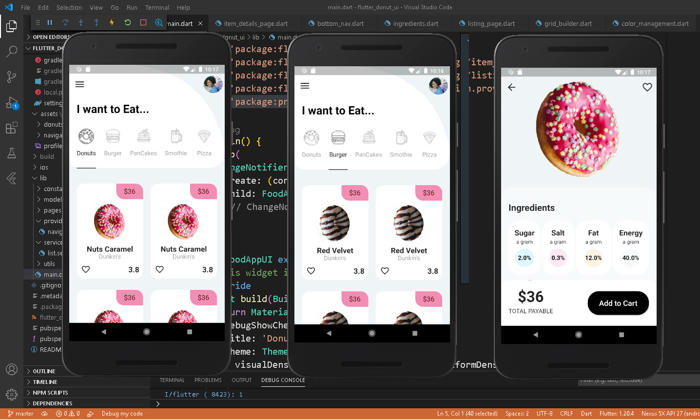

# Flutter Donut UI

Flutter UI challenge 008 - Donut UI

[Github](https://github.com/codingbbq/flutter_donut_ui)

[Design](https://dribbble.com/shots/13901290-Donut-UI)

[Youtube @codingbbq](https://www.youtube.com/channel/UCcxqwN9AGUNd3C9bNmvVlhw)

---

## Live stream logs

The playlist of the livestreams done during this project can be found at 
-[Donut UI - Live Streams](https://www.youtube.com/playlist?list=PLXhGtHdNMDklU_QQB-7LtrB2b0BfpzSp5)

The idea of this live stream is to document my learnings in Flutter. 

# What went well
- Used Provider widget to maintain the state at various levels.
- Implemented http widget to get data from API. With this also learned how to create Dart Objects out of the response json.
- Implemented custom Painter on the UI. 
- Did data management and so had to spend couple of hours getting images and maintaining data.

# What did not go well
- The entire app looked decent however some areas were not implemented. 
- Did not implement the third screen in the design.

Below are screenshot of the final UI

